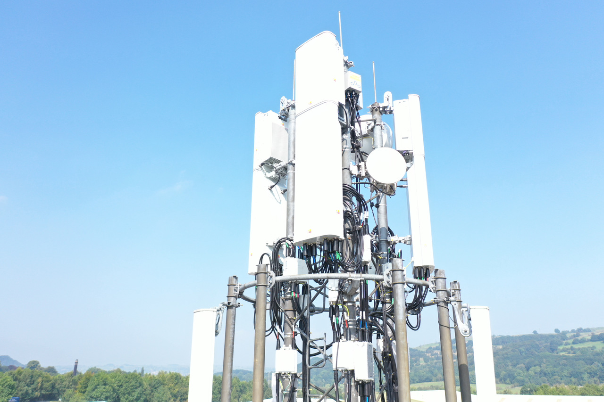
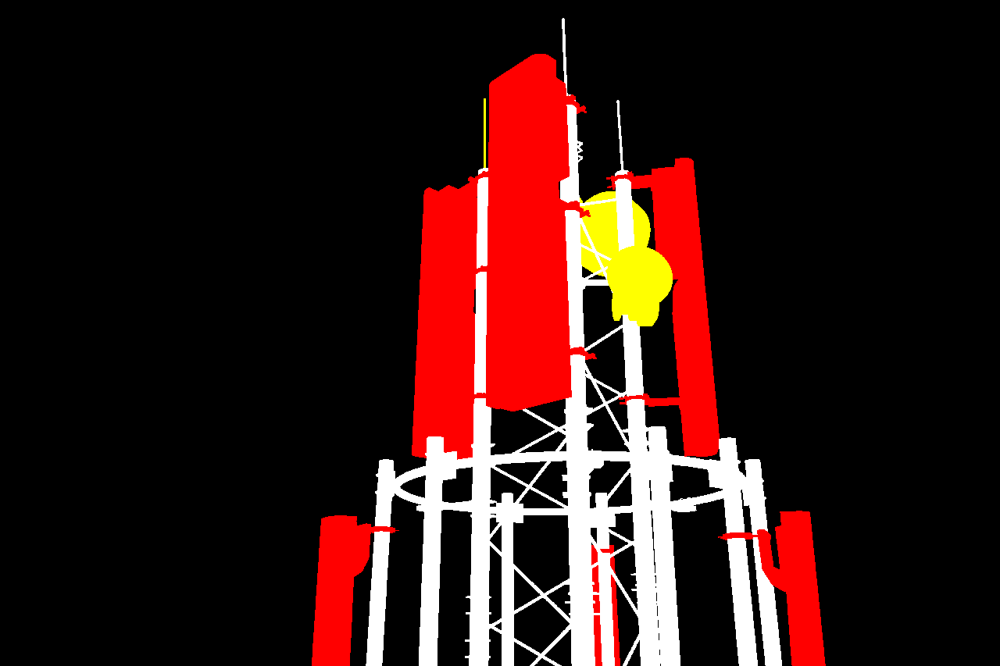
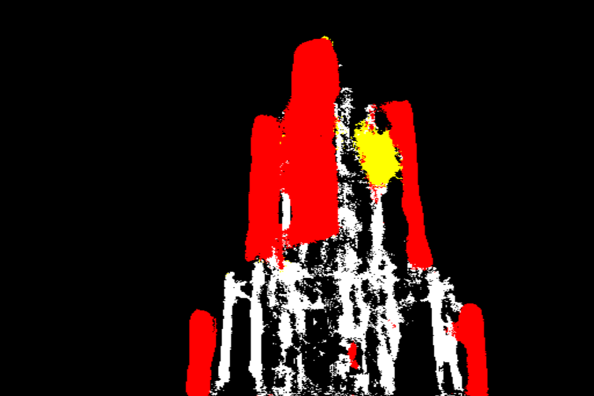
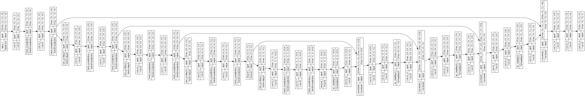

# Semantic image segmentation with neural networks
Example of a custom image segmentation problem:
given a photo, segment mobile antenna parts and background into classes:
 * Background (black)
 * Support structures (white)
 * Flat-panel antennas (red)
 * Dish-shaped antennas (yellow)

Example photo, ground truth mask and segmentation result (predicted mask):

|         Photo         | Mask (ground truth) |      Inference result      |
|:---------------------:|:-------------------:|:--------------------------:|
|  |  |  |

Currently U-Net neural network architecture [1] is implemented with some modifications:


### How to use:
* Pre-process labeled data (optional), to make it more suitable for training:\
`python segment.py pre_process -s ".../data" -d ".../training_data"`\
Expected `data` folder structure (strings in [ ] are arbitrary, but have to match):
```
     /data/
     -----/[pref1]_photos/
     --------------------/[img_name11.jpg]
     --------------------/[img_name12.jpg]
     --------------------/...
     -----/[pref1]_masks/
     -------------------/[img_name11].png
     -------------------/[img_name12].png
     -------------------/...
     -----/[pref2]_photos/
     --------------------/[img_name21.jpg]
     --------------------/...
     -----/[pref2]_masks/
     -------------------/[img_name21].png
     -------------------/...
     -----/...
```

* Train U-Net model:\
`python segment.py train  -d ".../training_data"  -m unet  -n 4`\
Here 4 is the number of different classes. `training_data` folder's structure is given below.
Images in `masks` are 512x512x1 grayscale, `photos` are 512x512x3 RGB. They can be produced with pre_process step.
```
     /training_data/
     --------------/masks/
     --------------------/timg_00000000.png
     --------------------/timg_00000001.png
     --------------------/...
     -------------/photos/
     --------------------/timg_00000000.png
     --------------------/timg_00000001.png
     --------------------/...
```  

* Inference (prediction):\
`python segment.py infer -m unet -i ".../image.jpg" -s ".../saved_models/unet_tf-64flt_20ep.h5"`\
Result will be saved in image_pred.png file. Multiple imput images are also supported.


### Tested on:
Python 3.9.13 with OpenCV 4.6.0, keras 2.9.0, matplotlib 3.5.2, numpy 1.22.4, Pillow 9.1.1, tensorflow-gpu 2.9.1 (with CUDA 11.6)


### References
1. Ronneberger, O., Fischer, P. and Brox, T. (2015) "U-Net: Convolutional Networks for Biomedical Image Segmentation", CoRR, abs/1505.0. Available at: http://arxiv.org/abs/1505.04597.
